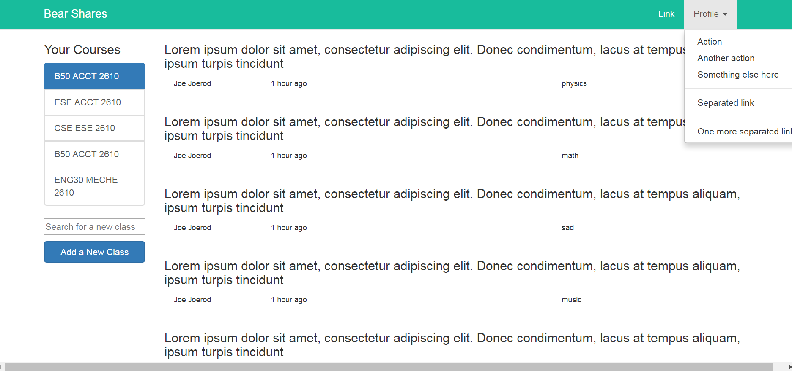
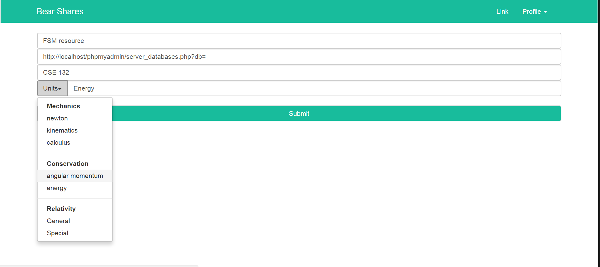

# django_BearShares
An online education resource sharing website for WashU (think reddit for educational content). Currently the database design and some of the frontend is complete, I am currently working on the Django backend.
## Database

